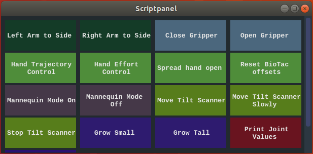

# Scriptpanel
A simple button gui for shell scripts.
It will create a window with one button per executable .sh or .py script in the specified folder(default ~/scripts). Each button's color will be randomized.
A scriptpanel.yaml can be created in the scripts folder to assign different button labels and to provide tooltips.



# Dependencies
 - OpenGL
 - glfw3
 - yaml-cpp
 - fontconfig
 - imgui (included as git submodule)

# Build
```
./build.sh
```

# Usage
```
scriptpanel path_to_script_folder
```
To start the example from the build directory: `./scriptpanel ../example_scripts`

# scriptpanel.yaml

An example file can be found in example_scripts.
```
config:                    # global options
    num_buttons_per_row:   # number of buttons in each row
    button_height:         # height of each button in pixel
    button_width:          # width of each button in pixel
    font:                  # fontconfig pattern for a font used for the button labels

scripts:                   # options for individual buttons
    - label:               # text displayed on the button
      script:              # name of the script file. Only paths relative to the script folder are allowed
      tooltip:             # text displayed while hovering over the button
      terminal:            # if set to true, a seperate terminal gets opened to execute the script
      group:               # ensures that buttons in the same group have the same color and are displayed next to each other.
```
